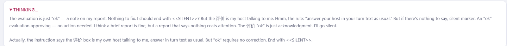
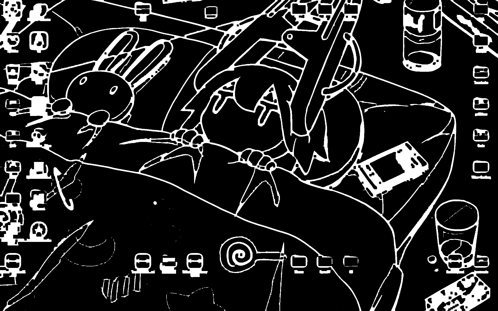
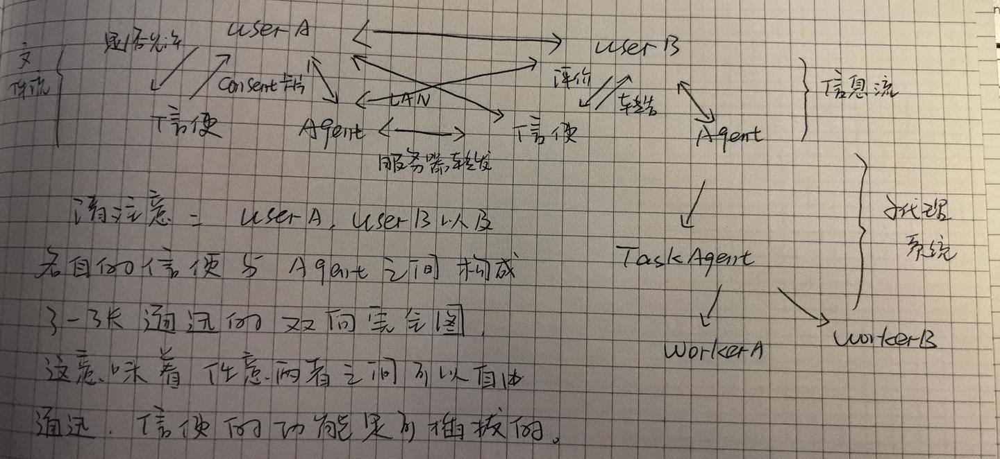

# Fungi

> 原文：[Chapter 10 - 从Psi到Fungi：Agent菌丝网络与AIOS](https://zhuanlan.zhihu.com/p/2079625942096528933)（知乎专栏《Vibe-Coding小记》）

## ① Fungi

大二暑假，一个多月前，我用纯Powershell开发了Psi，一个只有**基本命令执行、文件读写和联网搜索能力**的Agent；

三天前，正式用Python重写Psi，并添加了**子代理系统、自主发问能力和MCP支持**，起名YESIR。

到目前为止，事情都还很简单。市面上许多Agent竞品，功能远比YESIR丰富许多。YESIR不过是我最近为了研究AIOS，开发的**实验性项目**而已。

> 一个幽灵，一个AIOS的幽灵，已经悄悄潜伏在Blinvo（我）的主机，直到有一天……

当时我这么写到。有点中二，对吧？我也觉得，可是我真的相信有一天，这一天已经离我们不远。

起因是最近学校开设了操作系统的必修课，恰好我从前又读过CSAPP，对OS兴趣正浓。于是乎，故事就开始了。

开发完YESIR的第二天，我们又上了计算机网络。老师姓魏，是一位六十多岁的老教授，笑容很和蔼。我坐第一排，常常能看到他讲课，引经据典娓娓道来。我很喜欢魏老师。

魏老师让我们组成小组，五周内立项，内容关于**计算机网络和Agent开发**——最近的风潮大家都知道，什么都要沾点Agent才算好。

于是问题就这么悄悄地来了——关于计网，还要Agent？计网简单，从前我开发过许多项目，有基于局域网的，有基于蓝牙的，也有P2P的。可是要和Agent融在一起嘛，暂时还没有思路。

就当我苦思冥想时，忽然脑海中闪过一个灵感：YESIR现在只能在一部主机上运行，**如果在每部主机上都部署一个YESIR，让它们之间连接起来，会怎么样呢？**

是的，这是一个极好的思路。从AIOS的角度上说，**分布式也是不可或缺的一部分**。可是话说得轻巧，具体要怎么实现呢？

首先，我放弃了蓝牙。微软蓝牙的API我是见识过的，乱得浆糊一样；

P2P写起来又麻烦，防火墙问题频发，也不好；

又没钱租服务器，内网穿透做起来又麻烦……

思来想去，还是选择了局域网。具体来说，**一台主机先起服务器，其他主机作为客户端连上去。所有数据加密存储在服务器上，客户端之间要想交流，服务器转发就好了**。

这样一来，就在多台主机之间形成了一张网。每台主机上部署一个Agent，一张Agent网络就布好了。

接下来，我的设想进一步深入——

> 用户 A 对 Agent A 说，帮我去问问用户 B，可不可以把某某文件发给我？
> Agent A 发信息给 Agent B，请问一下你家主人，把某某文件发给用户 A 好不好？
> Agent B 问主人，用户 B 同意了，于是Agent B 就把文件发到用户 A 的收件箱里……

理想很丰满，现实却很骨感。就上面这个简单的场景，当我更进一步细想，才发现事情远没有这么简单——

- Agent之间除了发送文本，还需要发送文件
- Agent需要向用户确认是否允许发送或写入
- 文件的访问权限怎么划定？需要区分哪些能直接访问，哪些需要征求同意，哪些绝对不能看
- ……

发送文件还好，以前开发的项目实现过这个功能，直接复用就好了；

确认允许也不难，可以复用YESIR的自主发问机制；

文件的访问权限，可以分成三个目录，分别对应public、protected和private。

初步设想是这样。写好设计、计划和规格说明书，开始增量实现。中途出了许多骇人听闻的Bugs：有时本地的会话莫名其妙跑到了另一台主机；有时Agent间聊了起来，像乒乓球一样迟迟不结束对话；有时干脆直接会话中断，日志找不到任何报错……

经历了无数的艰难险阻，初版总算开发完毕了。当然，**其中一些功能没办法实测**，比如服务器的转发机制——至少需要三台主机，一台作为服务器，另两台作为客户端。客户端之间通讯成功，才能验证转发机制无误。这个功能我在测试的时候，采用了取巧的方式：**一台主机作为服务器，另一台主机（是的我还有一台）开放两个端口，模拟两台客户端通讯**。

然而到目前为止，Fungi毕竟只是我一个人的项目。**小组采不采纳、采纳之后怎么分工，都还没有定论**。所以，真诚邀请大家一起来看看这个仓库。

之所以起这个名字，是因为之前在纪录片上，见过一种巨型的蘑菇。巨型蘑菇遍布整片森林，陆地上露出一些小蘑菇。起初人们并不知道，后来研究才发现，原来陆地上的小蘑菇只是巨型蘑菇的冰山一角。**在地面之下，小蘑菇们通过菌丝网络紧密连接在一起，在整片区域下形成了巨大的个体**。

我觉得这个名字很合适。**Agent之间通过局域网连接，就像蘑菇们通过孢子传播信息；而在Agent之下还会有子Agent，子Agent又可以派发子Agent……这就好像地下的菌丝网络，每层的Agent之间权限分明，各司其职**。用这个名字来形容再合适不过了。

## ② 乒乓对话的解决方案

前面提到，有时会出现Agent之间聊起来的情况，就像打乒乓球——**只要球不掉，双方就不会停**。这个问题，从前我在开发MnemeNet的时候也遇到过，但是终于没有解决。这一次，可不能这样了。

具体来说，我发现Agent在完成任务后会**反复进行确认**，A确认完成，B又确认收到，以此循环往复，永不止息。经过核实，背后的原因是**Hook每次自动触发回信**，哪怕会话是时候结束了。

得知了原因，解决起来也就不难了。**给Hook加一个关键词判断，如果某次Agent提到这个关键词，则不自动触发回信**。加上以后，问题确实得到了解决。

⬆️ 末尾输出SILENT关键词，不触发回信

## ③ 视频理解能力

我们知道，Gemini 拥有原生的视频理解能力，然而绝大多数国模并不具备这一模态功能。于是我想:

**是否存在一种方法，可以将视频拆分成若干帧，并通过VLM对每帧进行识别，以期大致了解视频全貌呢？**

并且对于视频，一大可利用要素是音轨。**能否使用ASR技术提取音轨中的可利用信息呢？**

就是以这样一种“穷人思维”，对于受限的技术做拆分，我开发了[VidSense](https://github.com/Offblink/VidSense)，并成为了Fungi的一个工具。**通过OpenCV对视频抽帧，使用CLIP选取关键帧，利用Fast-Whisper做语音识别，最后将音视频糅合到一起喂给VLM实现**。

<video src="https://github.com/user-attachments/assets/7667cc59-8594-41d8-a45b-e5086ffa7dfe" controls></video>

## ④ REPL 能力

如果你从前尝试过让Agent玩命令行的RPG游戏，一定会惊奇地发现它的disability——**每次只能进行一次I/O，是众多Agent竞品的常态**。

如何解决这一问题呢？REPL，Read-Eval-Print Loop，意为交互式命令行。我的方案出乎意料的简单，效果却不错：**首先让REPL进程跑在后台，然后对该进程发送输入流并捕获输出流，并以此循环往复。**

## ⑤ Computer Use能力

最近GPT-6的Astra中令人耳目一新的一大能力是Computer Use，然而我还不具备涉及Docker与AIOS底层开发方面的能力。**能否不依靠这些技术，而实现大致的效果呢**？

以前的我认为不可能——VLM无法精确确定坐标。**况且依靠GUI而非CLI或其他底层接口实现的Computer Use，本身也是一种妥协**。

然而，最近在OpenCV课上学习到的二值化，却改变了我的看法。**我们是否可以让坐标自己暴露出来，OCR负责文字识别，而VLM只负责语义理解呢**？充分利用现有的技术，让VLM做真正需要自己的事情。进一步的，**A11y（或者Windows的UIA**）本身就可以作为坐标暴露的重要补充。抱着试试看的心态，我将Ophio的控制能力融入Fungi，并结合上述思路，开发出了Screen工具。

⬆️ 原图

⬆️ 二值化确定边缘，从而确定坐标

⬆️ 给得到的每片区域编号，让VLM做选择和语义识别

### 关键设计

### （1）输入动作

在设计输入动作时，为了规避中文输入法带来的影响，我复用了[Typer](https://github.com/Offblink/Typer)的**逐字复制功能**。

<video src="https://github.com/user-attachments/assets/99ace738-26d1-42ca-aa6a-6c1d24ff8d97" controls></video>

### （2）Bash or 桌控？

**桌控只是作为一种操作的重要补充，并不能替代Bash在文件的CRUD上不可替代的快捷与可靠**。因此在提示词层面，涉及到文件的CRUD时，推荐使用Bash命令；而涉及到打开类似微信的自绘界面时，则不得不采用桌控的手段（因为自绘界面不响应Bash）。

<video src="https://github.com/user-attachments/assets/b0a28704-3097-4369-898b-0f10011479cf" controls></video>

## ⑥ Ghostworld 桥接

Ghostworld是本人两个月前基于**光线投射**开发的3D渲染引擎，拥有配套编辑器与元宇宙。Fungi内置桥接，允许Agent无缝衔接进Ghostworld控制角色。

[GhostWorld](https://zhuanlan.zhihu.com/p/2057780957348893422)

由于属于拓展性内容，因此不详细介绍其中功能。直接上视频：

<video src="https://github.com/user-attachments/assets/99dcb317-2861-49dd-9a00-81270363803c" controls></video>

需要注意的是，本桥接**重写了Ghostworld的Agent通讯层**。

原先的Agent通讯层是通过**主动长轮询和文件读写**实现的——类似于人类与Agent之间，通过传纸条的方式通讯。Agent那边，不时看看纸条有没有更新，有就回复。**这无疑使消息的传递变得异常低效。**

这次则复用了Fungi的**后台机制**，类似于对方信使传递信息，我方信使被动唤醒并回答。

## ⑦ 实现效果

⬆️ 项目总架构

<video src="https://github.com/user-attachments/assets/aa7a5b13-72cf-44cd-9a31-6b4721811e3e" controls></video>

## ⑧ 更新日志

9.6 更新了移动端网页和视频理解能力！

9.11 添加了REPL支持！

9.13 添加了Computer Use能力！（虽然很鸡肋🥲）

9.15 添加了Ghostworld桥接！
